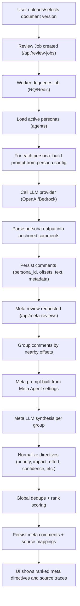
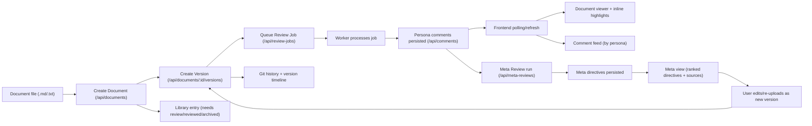

# OpinionatedDocReviewer

OpinionatedDocReviewer is a document review application that runs multiple AI personas in parallel, anchors comments to document text, and displays live reviewer feedback in a professional UI.

## What It Does

- Upload `.md` and `.txt` documents with drag-and-drop.
- Auto-creates a document + version on upload.
- Runs persona reviews and streams comments into the live feed.
- Highlights commented sections and links them visually to feed comments.
- Saves review runs by document version.
- Supports manual re-review as an explicit override action.

## Stack

- Frontend: Next.js (React, TypeScript)
- Backend: FastAPI (Python)
- Queue/Workers: Redis + RQ
- Local persistence: SQLite (current local dev setup)
- Document/review artifact history: Git-backed local repos under `.run/doc-repos`

## Architecture Diagrams

### Agents + Meta Agent



### End-to-End Review Flow



## Quick Start

### 1. Start dependencies

Make sure Redis is running (for queued reviews):

```bash
brew services start redis
```

### 2. Start the app

From repo root:

```bash
./scripts/admin/start.sh
```

Useful scripts:

- `./scripts/admin/status.sh`
- `./scripts/admin/restart.sh`
- `./scripts/admin/stop.sh`

### 3. Open UI

- Frontend: `http://localhost:${FRONTEND_PORT:-3000}`
- Backend API: `http://localhost:8006/api`

## UI Routes

The app now uses path-based navigation. Refresh keeps you on the same page:

- Home: `/`
- Library: `/library`
- Agents: `/agents`
- History: `/history`
- System: `/system`
- Admin: `/admin`

Home supports deep links to a document:

- `/?doc=<document_id>`: open that document on load
- `/?doc=<document_id>&run=1`: open and start a review run once, then normalize URL back to `/?doc=<document_id>`

Top-left brand icon always navigates back to home (`/`).

## Testing

Backend:

```bash
cd backend
uv sync --extra test
uv run pytest
```

Frontend:

```bash
cd frontend
bun run test
```

Browser smoke (Chrome/Chromium nav + panel checks):

```bash
cd frontend
bun run test:smoke
```

## Environment

Do not commit secrets.

- Root `.env` and `backend/.env` are gitignored.
- Copy `.env.example` to `.env` for local runtime port/api defaults.
- Runtime ports:
  - `PORT` controls backend API port (default `8006`).
  - `FRONTEND_PORT` controls frontend port (default `3000`).
  - Frontend scripts honor `PORT` first, then `FRONTEND_PORT`.
- Configure provider settings via the UI: `System` panel in `http://localhost:${FRONTEND_PORT:-3000}`.
- Or configure via `backend/.env` / `backend/config.toml` (examples in `backend/.env.example` and `backend/config.example.toml`).
- CORS is configurable in backend env/config; see `PRODUCT.md`.
- Frontend API routing can be configured in root `.env`:
  - `NEXT_PUBLIC_API_BASE` is the primary API base used by browser calls and Next rewrite.
  - Optional `NEXT_SERVER_API_BASE` can override only the server rewrite target when needed.
  - Example for reverse proxy: `NEXT_PUBLIC_API_BASE=https://odr.zlyxy.me/api`.

## Authentication (OIDC/JWT)

Backend supports two auth modes:

- `AUTH_MODE=oidc` (recommended for production)
- `AUTH_MODE=header` (simple deployment mode without external IdP)
- `AUTH_MODE=local` (email/password + verification + MFA/reset endpoints)

OIDC settings (`backend/.env` or `backend/config.toml`):

```env
AUTH_MODE=oidc
OIDC_ISSUER_URL=https://<your-issuer>
OIDC_AUDIENCE=<your-api-audience>
OIDC_JWKS_URL=https://<your-issuer>/.well-known/jwks.json
OIDC_TENANT_CLAIM=tid
OIDC_EMAIL_CLAIM=email
OIDC_NAME_CLAIM=name
OIDC_ROLES_CLAIM=roles
OIDC_ADMIN_ROLE=admin
OIDC_ALLOW_LOCAL_HEADER_FALLBACK=true
```

Frontend:

- Open `System` → `Client Connection`
- Paste JWT into `OIDC/JWT Access Token`
- Click `Save Connection`

The frontend sends `Authorization: Bearer <token>` on all API requests.

Header auth mode (no IdP):

```env
AUTH_MODE=header
```

In `header` mode, the client uses `X-Tenant-Id`/`X-User-Email` headers and does
not require a bearer token.

Local auth mode (phase-1 foundation):

```env
AUTH_MODE=local
LOCAL_AUTH_JWT_SECRET=<32+ char secret>
AUTH_DEV_ECHO_CODES=false
```

Endpoints:

- `POST /api/auth/register`
- `POST /api/auth/verify-email`
- `POST /api/auth/login`
- `POST /api/auth/logout`
- `POST /api/auth/forgot-password`
- `POST /api/auth/mfa/challenge`
- `POST /api/auth/mfa/verify`
- `POST /api/auth/reset-password`

Phase 2 authorization controls (admin):

- `GET /api/admin/policies`
- `POST /api/admin/policies`
- `PATCH /api/admin/policies/{id}`
- `GET /api/admin/policy-decisions`

Policy behavior:

- Explicit `deny` policies override role grants and document ACL allows.
- Policies can match on role plus `user_tags_any` and `document_tags_any` conditions.
- Each document permission check writes a decision entry for auditing.

For local development convenience, `OIDC_ALLOW_LOCAL_HEADER_FALLBACK=true` allows localhost requests without a bearer token to continue using legacy header identity. Set this to `false` in stricter environments.

Security defaults now enabled:

- Rate limiting middleware is on by default (`RATE_LIMIT_ENABLED=true`)
- CORS defaults are explicit (no wildcard methods/headers)
- Default SQLite path is under `.run/app.db` (not project root)

## Reverse Proxy Support

Backend supports running behind a reverse proxy with configurable hostname and
forwarded-header trust controls.

Set in `backend/.env` or `backend/config.toml`:

```env
# Hostname enforcement ("*" allows any host)
ALLOWED_HOSTS=*

# Trust X-Forwarded-* headers from known proxy IPs
TRUST_PROXY_HEADERS=true
PROXY_TRUSTED_IPS=10.0.0.10,127.0.0.1
```

Common examples:

```env
# Only allow your public hostname
ALLOWED_HOSTS=odr.zlyxy.me

# Allow wildcard host routing
ALLOWED_HOSTS=*.zlyxy.me,zlyxy.me

# Trust forwarded headers from any proxy IP (only in controlled networks)
PROXY_TRUSTED_IPS=*
```

When TLS terminates at the proxy and the app runs local HTTP, enabling
`TRUST_PROXY_HEADERS=true` allows the app to correctly interpret upstream
scheme/connection information (for example, `X-Forwarded-Proto: https`).

Client API endpoint configuration:

- Set `NEXT_PUBLIC_API_BASE` for the frontend (see `/Users/zob/src/OpinionatedDocReviewer/frontend/.env.example`).
- If unset, the client uses `${window.location.origin}/api`, which works for same-origin reverse proxy setups.
- Runtime override is available in UI: `System` -> `Client Connection` (stored in `localStorage` as `odr_api_base`).

### Reverse Proxy Setup Examples

Single-domain setup (frontend + backend behind one hostname, e.g. `https://odr.zlyxy.me`):

- Reverse proxy routes:
  - `/api/*` -> backend (`:8006`)
  - default `/` -> frontend (`:3000`)
- Frontend env:
  - leave `NEXT_PUBLIC_API_BASE` unset (default `${window.location.origin}/api`)
  - or explicitly set `NEXT_PUBLIC_API_BASE=https://odr.zlyxy.me/api`
- Backend env:

```env
ALLOWED_HOSTS=odr.zlyxy.me
TRUST_PROXY_HEADERS=true
PROXY_TRUSTED_IPS=*

# Choose one auth mode:
AUTH_MODE=header
# or:
# AUTH_MODE=oidc
```

OIDC mode behind proxy:

- Keep `AUTH_MODE=oidc` and configure `OIDC_*` values.
- In UI, set `System` -> `Client Connection` -> `OIDC/JWT Access Token`.
- If no token is provided, API calls return `{"detail":"Authorization bearer token is required"}`.

For Debian 12/13 production-style service setup (`systemd` for backend/frontend/worker), see:
- `/Users/zob/src/OpinionatedDocReviewer/backend/README.md` ("Debian 12/13 systemd Deployment")

## Agent Import/Export Packs

Agent Studio supports structured portability for reviewer configs:

- Export bundle: `GET /api/personas/bundle/export`
- Import bundle: `POST /api/personas/bundle/import`
  - `conflict_policy`: `skip|overwrite|rename`
  - `dry_run`: preview without persisting

Format and sharing conventions:

- `/Users/zob/src/OpinionatedDocReviewer/docs/agent-pack-format.md`

## LLM Provider Setup

The app supports two review providers:

- `openai`
- `bedrock` (AWS Bedrock)

Set provider:

```bash
LLM_PROVIDER=openai
# or
LLM_PROVIDER=bedrock
```

After changes, restart:

```bash
./scripts/admin/restart.sh
```

### OpenAI Configuration

Required:

```bash
LLM_PROVIDER=openai
OPENAI_API_KEY=sk-...
```

Optional tuning:

```bash
OPENAI_MODEL=gpt-4o-mini
OPENAI_MAX_TOKENS=700
OPENAI_TEMPERATURE=0.2
OPENAI_TIMEOUT_SECONDS=30
```

Official docs:

- OpenAI API keys: [OpenAI API Keys](https://platform.openai.com/api-keys)
- OpenAI Responses API: [Responses API](https://platform.openai.com/docs/api-reference/responses)
- Model reference: [OpenAI Models](https://platform.openai.com/docs/models)

### AWS Bedrock Configuration

Required:

```bash
LLM_PROVIDER=bedrock
BEDROCK_MODEL_ID=anthropic.claude-3-5-haiku-20241022-v1:0
BEDROCK_REGION=us-east-1
```

Credentials (choose one):

- Standard AWS credential chain (recommended): IAM role, `~/.aws/credentials`, SSO, etc.
- Explicit env values:

```bash
BEDROCK_AWS_ACCESS_KEY_ID=...
BEDROCK_AWS_SECRET_ACCESS_KEY=...
BEDROCK_AWS_SESSION_TOKEN=... # optional
```

Official docs:

- Bedrock user guide: [Amazon Bedrock Documentation](https://docs.aws.amazon.com/bedrock/)
- Bedrock model IDs/availability: [Supported foundation models in Amazon Bedrock](https://docs.aws.amazon.com/bedrock/latest/userguide/foundation-models-reference.html)
- Bedrock Converse API: [Converse API](https://docs.aws.amazon.com/bedrock/latest/APIReference/API_runtime_Converse.html)
- AWS credentials: [Boto3 Credentials](https://boto3.amazonaws.com/v1/documentation/api/latest/guide/credentials.html)

## Meta Reviewer Calibration

Meta Reviewer synthesis priorities are calibrated as:

- `critical`: unsafe, incorrect, or security/compliance-dangerous content
- `high`: materially misleading or likely to cause implementation mistakes
- `medium`: quality issues that should be improved
- `low`: stylistic or optional improvements

Categories:

- `structure`, `clarity`, `technical`, `security`, `accessibility`, `style`

Operational safeguards:

- Input guardrails cap source comments/groups for a single synthesis run.
- If synthesis fails, API returns a clear error and fallback unsynthesized mode is available.
- Meta runs log structured completion/failure entries with tenant/version/job context and duration.
- Global dedupe merges near-duplicate directives using a configurable similarity threshold.

### Meta Agent Settings (UI + Config)

Meta reviewer behavior is fully editable in the `System` page (`/system`) and persisted to backend config.

Editable fields:

- Identity: `meta_agent_name`, `meta_agent_description`
- Prompting: `meta_agent_system_prompt`, `meta_agent_focus_areas`, `meta_agent_tone`, `meta_agent_reference_notes`
- Output policy: `meta_agent_output_format`, `meta_agent_output_max_bullets`
- Output guards: `meta_agent_output_require_quote_excerpt`, `meta_agent_output_require_actionable`, `meta_agent_output_include_severity`
- Examples + controls: `meta_agent_examples`, `meta_max_directives_per_group`, `meta_global_dedupe_threshold`

## GitHub Push Notes

If branch/upstream errors appear:

```bash
git branch -M main
git remote add origin git@github.com:<your-user>/<your-repo>.git
git push -u origin main
```

If `origin` already exists, update it:

```bash
git remote set-url origin git@github.com:<your-user>/<your-repo>.git
git push -u origin main
```
